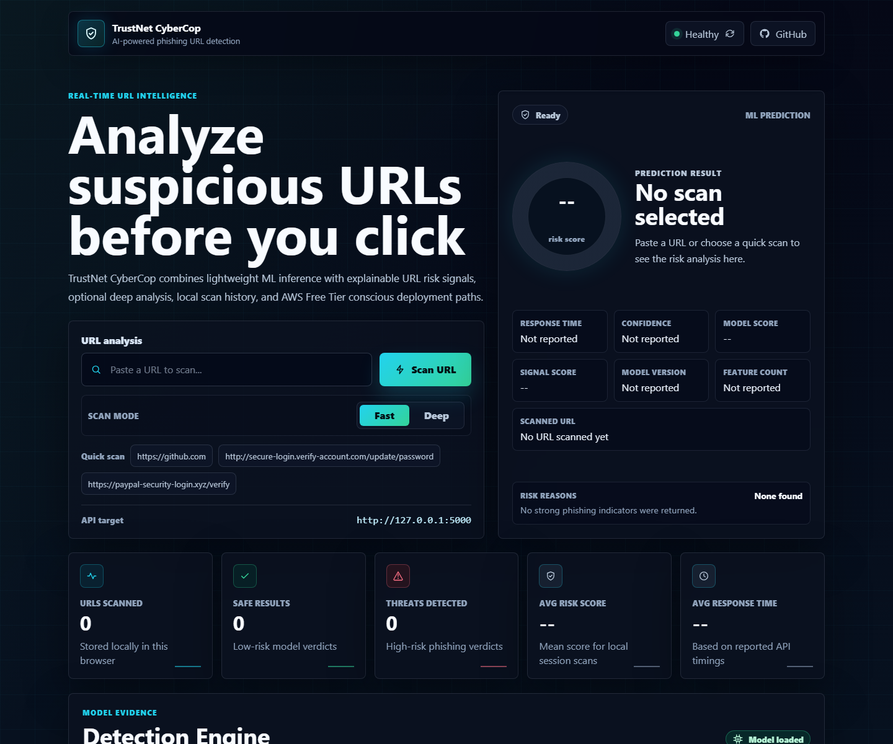
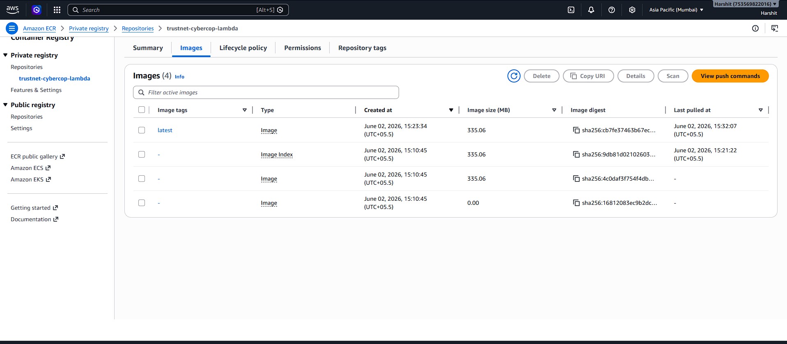
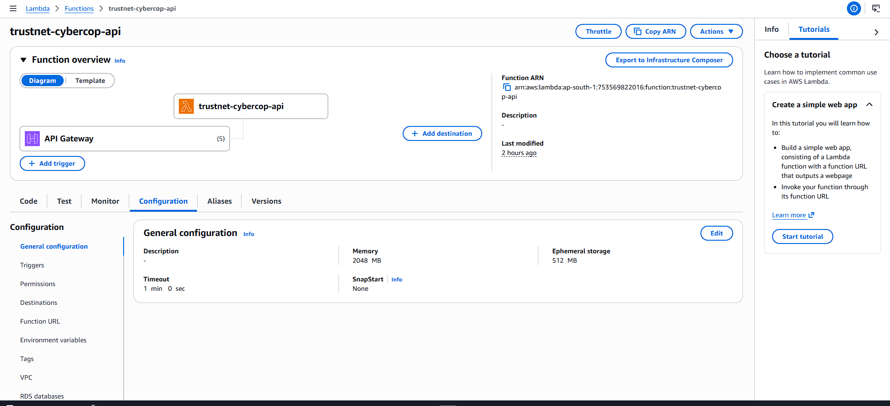
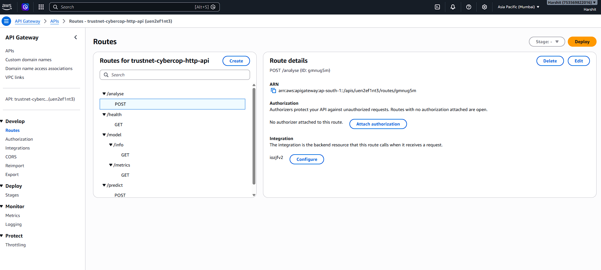
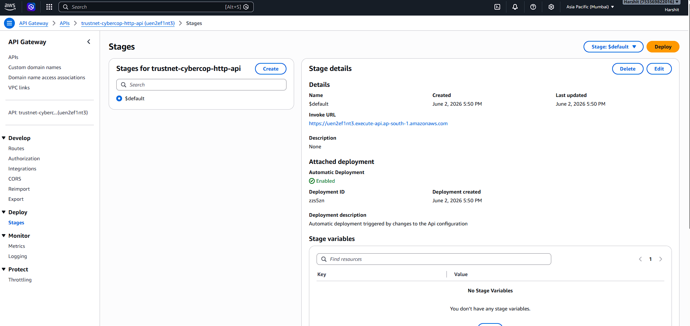
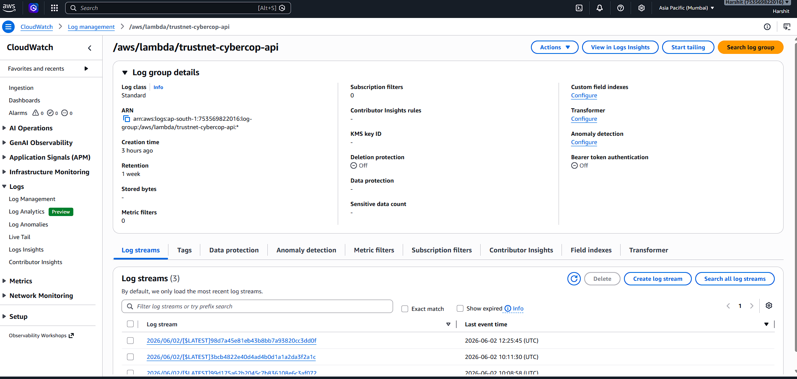
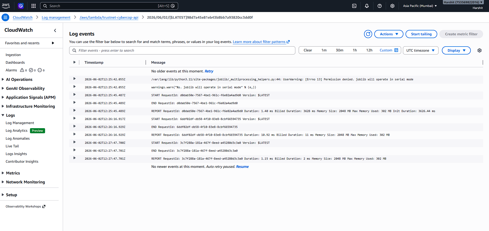
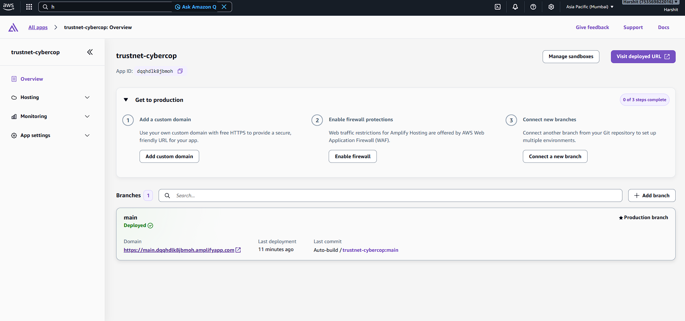
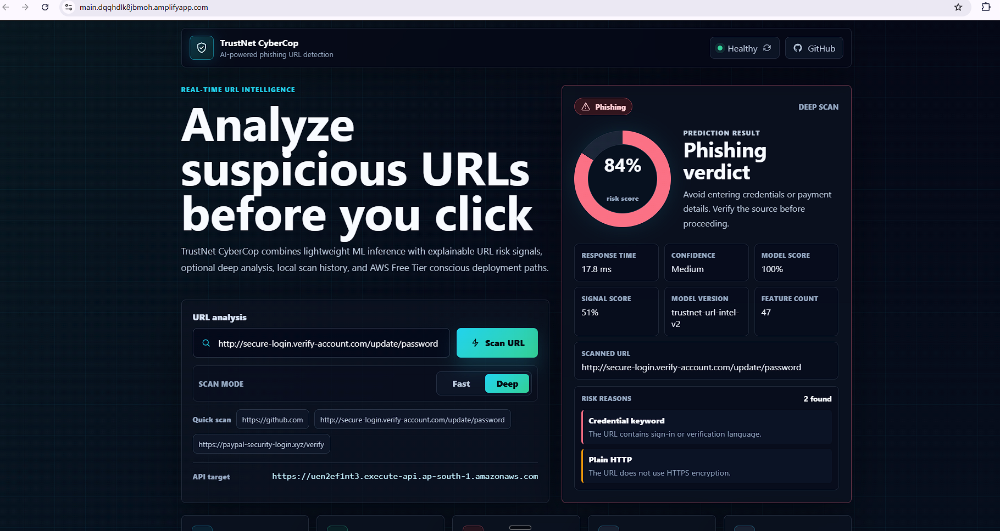
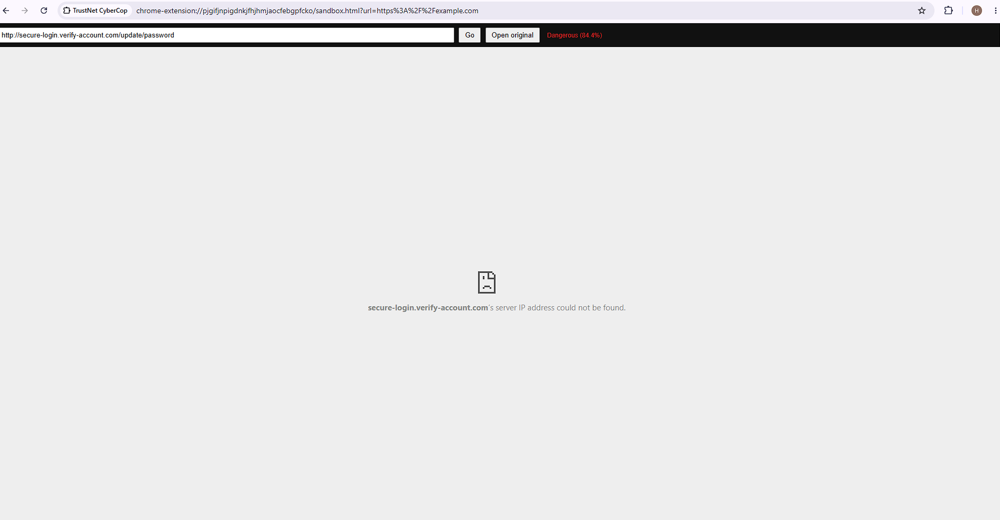

# TrustNet CyberCop

[](https://github.com/Harshitsharma010/trustnet-cybercop/actions/workflows/ci.yml)

**Deployed phishing URL intelligence platform with a feature-rich ML API, React dashboard, Chrome extension workflow, AWS Lambda/API Gateway backend, Docker setup, and AWS Free Tier conscious architecture.**

TrustNet CyberCop is a cybersecurity project that analyzes suspicious URLs before a user opens them. It combines 47-feature URL intelligence, lightweight ML inference, explainable risk reasons, a REST API, a dashboard interface, and a Chrome extension workflow to demonstrate how phishing detection can be packaged as a practical cloud-ready security tool.

> **Project status**  
> Built as a portfolio and hackathon-origin project. The repository includes working application code, a trained local model artifact, model metrics, Docker/Gunicorn setup, Lambda container support, AWS deployment evidence, and a Chrome extension wired to the deployed API. It is not presented as a production security product.

## Live AWS Deployment

- **Live Dashboard:** https://main.dqqhdlk8jbmoh.amplifyapp.com
- **Backend API:** https://uen2ef1nt3.execute-api.ap-south-1.amazonaws.com

The React dashboard is hosted on AWS Amplify and connected to the AWS Lambda backend through API Gateway.

### Verified API Endpoints

- `GET /health`
- `POST /predict`
- `GET /model/info`
- `GET /model/metrics`

Cloud deployment completed and verified using AWS Lambda, API Gateway, ECR, Amplify, CloudWatch, and Chrome extension integration.

## AWS Services Used

| Layer | AWS Service | Purpose |
| --- | --- | --- |
| Container Registry | Amazon ECR | Stores the Lambda backend image |
| Backend Runtime | AWS Lambda | Runs the ML inference API |
| API Layer | API Gateway HTTP API | Exposes public API routes |
| Frontend Hosting | AWS Amplify | Hosts the React dashboard |
| Monitoring | CloudWatch Logs | Captures Lambda execution logs |
| Cost Control | CloudWatch log retention | Limits logs to 1 week |
| Browser Workflow | Chrome Extension | Connects extension workflow to deployed AWS API |

## Deployed AWS Architecture

```text
User / Chrome Extension / React Dashboard
|
v
AWS Amplify Hosted Dashboard
|
v
API Gateway HTTP API
|
v
AWS Lambda Container
|
v
TrustNet ML Model + 47 URL Features
|
v
CloudWatch Logs
```

## 2026 Upgrade Highlights

| Upgrade | What changed |
| --- | --- |
| Feature-rich detector | Replaced the old 9-feature URL model path with a 47-feature URL intelligence pipeline |
| Hybrid scoring | Blends scikit-learn model probability with explainable heuristic risk signals |
| Explainable API | Returns verdict, risk score, model score, signal score, confidence, ranked reasons, features, and model version |
| Model evidence | Adds `backend/model_metrics.json`, `/model/info`, `/model/metrics`, and `MODEL_CARD.md` |
| AWS Free Tier path | Adds `backend/lambda_handler.py`, `backend/Dockerfile.lambda`, `AWS_FREE_TIER.md`, and deployed AWS proof screenshots |
| Dashboard intelligence | Shows fast/deep scan mode, model metadata, evaluation metrics, top features, and risk reasons |

## Why This Project Matters

Phishing remains one of the most common ways users are tricked into sharing credentials or opening unsafe links. TrustNet CyberCop demonstrates a practical security workflow:

1. Accept a URL from a dashboard, API client, or Chrome extension.
2. Extract phishing-relevant URL signals.
3. Run the signals through an ML model.
4. Return a clear risk verdict: `Safe`, `Suspicious`, or `Dangerous`.
5. Surface the result through a user-facing dashboard or extension workflow.

This project is relevant for cloud, cybersecurity, AI/ML, and full-stack internship roles because it connects model inference, REST API design, frontend UX, browser extension behavior, Dockerized deployment, and AWS hosting configuration.

## Key Features

| Feature | Description |
| --- | --- |
| ML phishing detection | Uses 47 URL-derived features and a trained Extra Trees model to estimate phishing risk |
| Explainable risk scoring | Returns ranked risk reasons such as brand impersonation, IP host, URL shortener, risky TLD, and credential keywords |
| Fast and deep scan modes | Fast mode stays URL-only for cheap inference; deep mode optionally checks redirects with short timeouts |
| Flask REST API | Provides `/`, `/health`, and `/predict` endpoints for service status and URL scanning |
| Lambda API handler | Provides an AWS Lambda/API Gateway path for Free Tier friendly pay-per-request hosting |
| React dashboard | Allows users to submit URLs and view risk verdicts from the browser |
| Chrome extension | Provides a suspicious-link checking workflow through a Manifest V3 extension |
| Docker backend | Runs the Flask API with Gunicorn inside a container |
| AWS deployment | Includes deployed Lambda/API Gateway backend evidence, Amplify hosting proof, ECR image proof, and CloudWatch logs |
| Logging | Logs prediction metadata including URL checked, verdict, score, and response time |
| API validation | Handles missing URLs, empty input, long URLs, invalid schemes, missing model files, and prediction errors |
| Model reporting | Exposes model version, feature count, training metrics, top features, and Free Tier posture |

## Tech Stack

| Layer | Technologies |
| --- | --- |
| Backend API | Python, Flask, Flask-CORS, Gunicorn |
| Machine Learning | scikit-learn, NumPy, SciPy via scikit-learn, joblib, ExtraTreesClassifier |
| Frontend Dashboard | React, Vite, TypeScript |
| Browser Extension | Chrome Manifest V3, JavaScript, HTML, CSS |
| Containerization | Docker |
| Cloud Deployment | AWS Lambda container + API Gateway, AWS Amplify Hosting, optional AWS App Runner |
| Configuration | `apprunner.yaml`, `amplify.yml`, environment variables |

## System Architecture

```text
User
  |
  | submits URL
  v
React Dashboard / Chrome Extension / API Client
  |
  | POST /predict
  v
Flask REST API
  |
  | validates URL
  v
Feature Extraction Pipeline
  |
  | creates model input features
  v
Hybrid ML Detector
  |
  | returns class, probability, and ranked reasons
  v
Risk Response
  |
  | Safe / Suspicious / Dangerous
  v
Dashboard or Extension UI
```

## Deployment Summary

The backend was containerized with Docker and pushed to Amazon ECR as a Lambda container image. AWS Lambda runs the ML inference backend, while API Gateway HTTP API exposes the public routes used by the dashboard, API clients, and extension.

The React dashboard is deployed on AWS Amplify and uses `VITE_API_BASE_URL` to call the API Gateway backend. CloudWatch Logs are enabled for Lambda execution visibility, with log retention set to 1 week for cost control. The Chrome extension has also been updated to use the deployed API Gateway backend instead of localhost.

## AWS Free Tier Deployment

```text
GitHub Repository
  |
  | source deployment
  v
AWS Lambda Container + API Gateway
  |
  | loads backend/model.pkl
  | exposes /health, /predict, /analyze, /model/*
  v
TrustNet Backend API

GitHub Repository
  |
  | dashboard app root
  v
AWS Amplify Hosting
  |
  | builds Vite React app
  | uses VITE_API_BASE_URL
  v
TrustNet Dashboard
```

**Backend deployment path used for Free Tier**

- Train locally and deploy only the saved model artifact.
- Package the backend with `backend/Dockerfile.lambda`.
- Use API Gateway HTTP API in front of Lambda.
- Keep fast scans as the default and use deep scans only on demand.
- Deployed API Gateway base URL:

```text
https://uen2ef1nt3.execute-api.ap-south-1.amazonaws.com
```

```bash
cd backend
docker build -f Dockerfile.lambda -t trustnet-cybercop-lambda .
```

**Backend plan, optional container demo**

App Runner is simpler for Flask/Gunicorn demos, but it can create always-on charges. Use it only when you are comfortable with that cost model.

```bash
gunicorn --chdir backend -w 2 -b 0.0.0.0:5000 api:app
```

**Frontend deployment path used**

- Deploy the React dashboard to **AWS Amplify Hosting**.
- Use `dashboard` as the app root.
- Use the included `amplify.yml`.
- Set `VITE_API_BASE_URL` to the API Gateway backend URL.

**Deployment proof**

- [ECR image tagged latest](screenshots/aws/01-ecr-image-latest.png)
- [Lambda function overview](screenshots/aws/lambda-function-overview.png)
- [API Gateway routes](screenshots/aws/api-gateway-routes.png)
- [API Gateway invoke URL](screenshots/aws/api-gateway-invoke-url.png)
- [Amplify deployment success](screenshots/aws/amplify-deployment-success.png)
- [Amplify live dashboard](screenshots/aws/amplify-dashboard-live.png)
- [CloudWatch log events](screenshots/aws/cloudwatch-log-events.png)
- [Chrome extension live scan](screenshots/aws/chrome-extension-live.png)

See [AWS_FREE_TIER.md](AWS_FREE_TIER.md) for the cost-control details.

## API Endpoints

### `GET /`

Returns service metadata and available endpoints.

Example response:

```json
{
  "service": "TrustNet CyberCop phishing detection API",
  "status": "running",
  "model_loaded": true,
  "endpoints": {
    "health": "/health",
    "predict": "/predict"
  }
}
```

### `GET /health`

Used for local checks, container health checks, and cloud monitoring.

Example response:

```json
{
  "status": "healthy",
  "model_loaded": true
}
```

### `GET /model/info`

Returns model metadata, feature count, thresholds, metrics summary, and AWS Free Tier posture.

### `GET /model/metrics`

Returns the saved evaluation payload from `backend/model_metrics.json`, including selected model, training sample count, precision, recall, F1, ROC-AUC, confusion matrix, and top feature importances.

### `POST /predict`

Runs the default fast scan. Fast scan is lightweight and does not perform external fetches.

Request:

```http
POST /predict
Content-Type: application/json
```

```json
{
  "url": "https://example.com",
  "deep_scan": false
}
```

Example response:

```json
{
  "url": "https://example.com",
  "final_url": "https://example.com",
  "status": "Safe",
  "verdict": "Safe",
  "risk_score": 1.3,
  "phishing_chance": 1.3,
  "confidence": "High",
  "model_score": 0.0,
  "heuristic_score": 4.0,
  "prediction": 0,
  "model_version": "trustnet-url-intel-v2",
  "feature_count": 47,
  "reasons": [],
  "response_time_ms": 158.8
}
```

### `POST /analyze`

Runs deep mode. Deep mode performs a short-timeout redirect inspection and is opt-in to control cost and latency.

### Status Logic

| Risk Score | Status |
| ---: | --- |
| `0% - 39.9%` | `Safe` |
| `40% - 69.9%` | `Suspicious` |
| `70% - 100%` | `Dangerous` |

## ML Detection Workflow

The backend converts a submitted URL into model-ready features before prediction. The deployed path is intentionally lightweight: training happens locally, while AWS only loads the saved model artifact for inference.

```text
Submitted URL
  |
  v
URL validation
  |
  v
Feature extraction
  |
  |-- URL length, path length, query length
  |-- hostname entropy, dots, hyphens, subdomain depth
  |-- IP host, HTTP usage, punycode, custom port
  |-- shortener, @ symbol, encoded characters, double slash
  |-- brand impersonation and suspicious keyword groups
  |-- risky TLD, executable path, free hosting domain
  v
Feature vector
  |
  v
Extra Trees model + explainable signal scoring
  |
  v
Prediction + risk reasons + confidence
```

The model is trained using `backend/train_model.py`, which downloads the public UCI PhiUSIIL Phishing URL Dataset by default, extracts TrustNet's 47 URL intelligence features, compares multiple lightweight scikit-learn models, selects the strongest model by phishing-focused metrics, and saves both `backend/model.pkl` and `backend/model_metrics.json`.

Current checked-in model:

| Item | Value |
| --- | ---: |
| Dataset | UCI PhiUSIIL Phishing URL Dataset |
| Full dataset size | 235,795 URLs |
| Training rows used | 60,000 balanced URLs |
| Held-out evaluation rows | 15,000 URLs |
| Accuracy | 99.65% |
| Precision | 99.80% |
| Recall | 99.51% |
| F1 | 99.65% |
| ROC-AUC | 99.79% |

For a larger real-world run, pass a CSV with `url,label` columns:

```bash
cd backend
python train_model.py --dataset-csv path/to/urls.csv
```

To train on the full downloaded PhiUSIIL dataset instead of the default balanced sample:

```bash
cd backend
python train_model.py --dataset phiusiil --max-samples 0
```

## Chrome Extension Workflow

The Chrome extension provides a browser-side workflow for safer URL handling.

```text
User enters or clicks a URL
  |
  v
Extension background/content script
  |
  v
Sandbox page opens with encoded URL
  |
  v
URL is checked against the Flask API
  |
  v
Result is shown to the user
  |
  v
User can decide whether to open the original URL
```

Extension capabilities in this repository:

- Manifest V3 configuration
- Omnibox keyword support using `sandbox`
- Background service worker
- Content script flow
- Popup UI for latest phishing result
- Sandbox page for controlled link review
- Default API target set to the deployed API Gateway backend:

```text
https://uen2ef1nt3.execute-api.ap-south-1.amazonaws.com/predict
```

To use the unpacked Chrome extension from the address bar, type `sandbox` first, press Space or Tab, then enter the URL to scan. Example:

```text
sandbox secure-login.verify-account.com/update/password
```

## Local Development Setup

### Prerequisites

- Python 3.11+
- Node.js 18+
- Docker Desktop, optional
- Chrome browser, for extension testing

### 1. Clone the repository

```bash
git clone https://github.com/Harshitsharma010/trustnet-cybercop.git
cd trustnet-cybercop
```

### 2. Run the Flask backend

```bash
cd backend
python -m pip install -r requirements.txt
python api.py
```

Backend URL:

```text
http://127.0.0.1:5000
```

Health check:

```bash
curl http://127.0.0.1:5000/health
```

Prediction request:

```bash
curl -X POST http://127.0.0.1:5000/predict \
  -H "Content-Type: application/json" \
  -d "{\"url\":\"https://example.com\",\"deep_scan\":false}"
```

Windows PowerShell:

```powershell
Invoke-RestMethod -Uri http://127.0.0.1:5000/predict `
  -Method Post `
  -ContentType "application/json" `
  -Body '{"url":"https://example.com","deep_scan":false}'
```

Model metadata:

```bash
curl http://127.0.0.1:5000/model/info
curl http://127.0.0.1:5000/model/metrics
```

### 3. Run the React dashboard

Open a second terminal:

```bash
cd dashboard
npm install
npm run dev
```

Production build:

```bash
npm run build
```

### 4. Run backend tests

```bash
python -m unittest discover -s backend/tests
```

## Docker Setup

The backend includes a Dockerfile that runs the Flask API through Gunicorn.

```bash
cd backend
docker build -t trustnet-cybercop-api .
docker run -p 5000:5000 trustnet-cybercop-api
```

Verify the container:

```bash
curl http://localhost:5000/health
```

The Dockerfile also includes a health check against `/health`.

## Environment Variables

| Variable | Used By | Required | Description |
| --- | --- | --- | --- |
| `ALLOWED_ORIGINS` | Flask API | Optional | CORS allowlist. Defaults to `*` for local/demo use |
| `VITE_API_BASE_URL` | React dashboard | Optional locally, recommended for deployment | Backend API base URL. Defaults to `http://127.0.0.1:5000` |

Example dashboard deployment value:

```text
VITE_API_BASE_URL=https://uen2ef1nt3.execute-api.ap-south-1.amazonaws.com
```

Example backend deployment value:

```text
ALLOWED_ORIGINS=https://your-amplify-app-url.amplifyapp.com
```

## Project Structure

```text
trustnet-cybercop/
|-- backend/
|   |-- api.py
|   |-- detector.py
|   |-- feature_extractor.py
|   |-- lambda_handler.py
|   |-- model_config.py
|   |-- train_model.py
|   |-- model.pkl
|   |-- model_metrics.json
|   |-- requirements.txt
|   |-- requirements-lambda.txt
|   |-- Dockerfile
|   |-- Dockerfile.lambda
|   `-- tests/
|-- dashboard/
|   |-- src/
|   |-- package.json
|   |-- vite.config.ts
|   `-- tsconfig.json
|-- extension/
|   `-- fixed_extension/
|-- screenshots/
|   `-- aws/
|-- apprunner.yaml
|-- amplify.yml
|-- AWS_DEPLOYMENT.md
|-- AWS_FREE_TIER.md
|-- DATASET.md
|-- MODEL_CARD.md
|-- SECURITY.md
`-- README.md
```

## AWS Deployment Proof

The repository includes local proof assets and AWS deployment evidence for the upgraded dashboard, Lambda/API Gateway backend, Amplify hosting, CloudWatch logs, and Chrome extension flow.

### Dashboard Preview



### Amazon ECR



### AWS Lambda



### API Gateway





### CloudWatch Logs





### AWS Amplify





### Chrome Extension



### Proof Matrix

| Proof Area | Status | Evidence |
| --- | --- | --- |
| Dashboard UI | Included | [Dashboard screenshot](docs/screenshots/dashboard.png) |
| API health | Included | [API health screenshot](docs/screenshots/api-health.png) |
| Prediction API | Verified | `backend/tests/test_detector_api.py` covers safe and dangerous URL predictions |
| Model metrics | Included | UCI-trained metrics in `backend/model_metrics.json` and [MODEL_CARD.md](MODEL_CARD.md) |
| AWS Free Tier path | Deployed | [AWS_FREE_TIER.md](AWS_FREE_TIER.md), `backend/lambda_handler.py`, `backend/Dockerfile.lambda`, and [AWS screenshots](screenshots/aws/) |
| React production build | Verified | `npm run build` passes for the Vite dashboard |
| Backend tests | Verified | `python -m unittest discover -s backend/tests` passes |
| Chrome extension workflow | Deployed API target | Canonical Manifest V3 extension in `extension/fixed_extension/` and [live extension proof](screenshots/aws/chrome-extension-live.png) |
| Cloud deployment proof | Included | ECR, Lambda, API Gateway, Amplify, and CloudWatch evidence in `screenshots/aws/` |

### API Health Proof

The Flask/Lambda API reports the upgraded model version, feature count, and Free Tier friendly profile:

```json
{
  "feature_count": 47,
  "model_loaded": true,
  "model_version": "trustnet-url-intel-v2",
  "profile": "free-tier-lightweight-hybrid",
  "status": "healthy"
}
```

## Free Tier and Cost-Control Notes

- Used Lambda + API Gateway instead of always-on EC2/App Runner for the primary deployed backend.
- Kept ML inference request-based, so compute runs only when the API is called.
- Lambda memory and timeout were tuned to support the ML model load while keeping compute request-based.
- Set CloudWatch log retention to 1 week to avoid unlimited log growth.
- Avoided RDS, NAT Gateway, SageMaker, Bedrock, and always-on infrastructure for this portfolio deployment.

## Security Considerations

- The API validates missing, empty, overly long, and non-HTTP/HTTPS URL inputs.
- CORS can be restricted through `ALLOWED_ORIGINS`.
- Prediction errors are handled with structured JSON responses.
- The model file is loaded at service startup and reported through `/health`.
- Deep scans skip private/local hosts to reduce SSRF risk.
- Fast scans do not perform external network fetches by default.
- The project should not be used as the only defense against phishing.
- For real deployment, add API rate limiting, stricter CORS, request logging controls, abuse protection, and monitoring.
- See [SECURITY.md](SECURITY.md) for the security posture, threat boundaries, and Free Tier-safe hardening backlog.

## Known Limitations

This is a portfolio and security education project, not a production-grade phishing protection service. The current implementation demonstrates the end-to-end workflow, but production usage would require additional safeguards:

- The checked-in model is trained on a balanced 60,000-row sample from UCI PhiUSIIL; use `--max-samples 0` or `--dataset-csv` for larger retraining runs.
- The model primarily uses URL-derived features and does not inspect webpage content by default.
- Deep scan is optional to reduce cost and latency.
- First request after inactivity may take longer because AWS Lambda container cold starts can occur.
- Public API Gateway URL is used for demo purposes.
- The Chrome extension flow is designed for demonstration and testing.
- The AWS deployment is configured for portfolio demonstration; production usage would need stronger abuse protection and monitoring.

## Resume-Ready Summary

- Deployed TrustNet CyberCop, an ML-powered phishing URL detection platform, on AWS using Lambda container images, API Gateway HTTP API, Amazon ECR, AWS Amplify, CloudWatch Logs, and Chrome extension integration with a Free Tier-conscious serverless architecture.

## Future Improvements

| Area | Improvement |
| --- | --- |
| AWS | Add a custom domain, stricter CORS origin, and production-grade API throttling |
| CI/CD | Add deployment checks against the live AWS backend and dashboard |
| Monitoring | Add CloudWatch metrics, alarms, and structured alerting |
| Security | Add rate limiting, stricter CORS, request size limits, and safer logging |
| ML | Optionally retrain on the full PhiUSIIL dataset or additional live phishing feeds |
| Product | Add scan history, downloadable reports, and richer dashboard analytics |
| Infrastructure | Add Terraform or AWS CDK for reproducible deployment |
| Extension | Add configurable API URL UI and clearer extension onboarding |

## License

This project is intended for educational, portfolio, and cybersecurity learning purposes.
